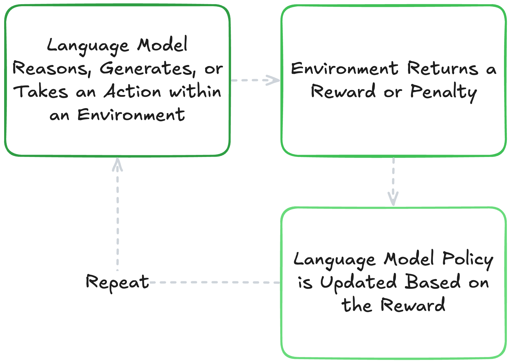
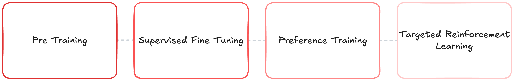
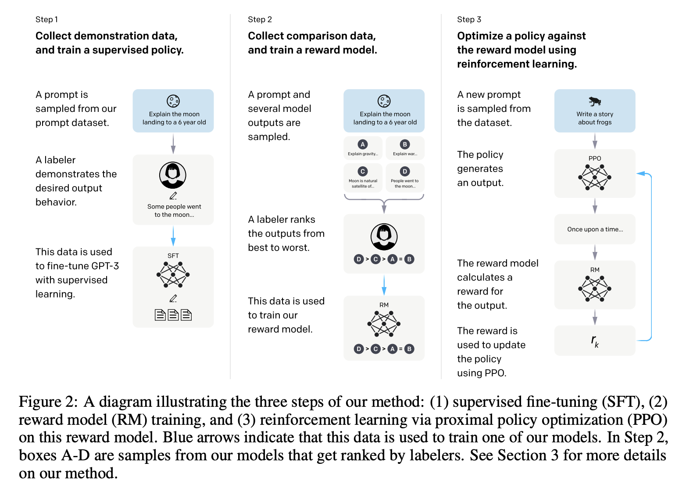
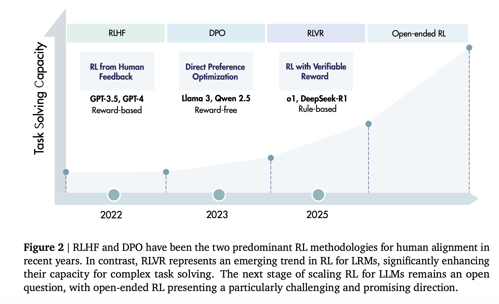

# Reinforcement Learning with LLMs

After a base large language model is pretrained, it goes through multiple rounds of post-training to shape and *align* how it responds. This post-training tends to focus on refining traits such as what it knows, how it reasons, and the style it uses. To do this, most modern systems rely on three main levers:

1. **Supervised Fine-Tuning (SFT)** to teach formats and tasks by imitation,
2. **Preference Training** to prefer better answers over worse ones, and
3. **Reinforcement Learning (RL)** to optimize for sequence-level goals and generalize procedures.

These techniques are used in different ways at different times in the model's training lifecycle depending on the alignment goal, often in an order that follows:

- **Pre-Training** a language model using next-token prediction at scale.
- **SFT** for base instruction-following + tools + formatting.
- **Preference Training** to push general answer quality and safety (RLHF, DPO/KTO or reward-model + small PPO).
- **Targeted RL** where you have strong rewards (coding, math, tool-using agents, browsing).
- **Continual Refresh** with new data, procedures, and preferences as they become available.

[Training language models to follow instructions with human feedback](https://arxiv.org/pdf/2203.02155)

Beyond pretraining and SFT, reinforcement learning is central to both preference training and (obviously) targeted RL above. For more on how RL drives alignment and preference optimization, check out my [other resource on LLM alignment in post-training here!](https://youtu.be/saddiaejp0s)

[A Survey of Reinforcement Learning for Large Reasoning Models](https://arxiv.org/pdf/2509.08827)

However, with a [general saturation of quality pre-training data](https://arxiv.org/pdf/2211.04325v2) and diminishing returns for scaling supervised fine-tuning techniques, we've seen many labs innovate more heavily with reinforcement learning techniques. 

In this notebook we'll cover:
- A light refresher of reinforcement learning in the context of large language models
- When and why RL is used with LLMs
- The adoption of reinforcement learning with verifiable rewards
- How to create your own RL environment and train an LLM within it!